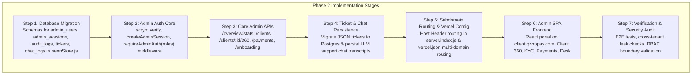

# QivroPay Internal Admin Panel Architecture Audit & Technical Specification

**Target Domain:** `client.qivropay.com`  
**Merchant App Domain:** `qivropay.com`  
**Status:** Architecture Audit & Specification (Phase 1 — No UI/Code Changes Applied)  
**Date:** September 2026  

---

## Executive Architecture Summary

The QivroPay Admin Panel operates as an isolated internal management interface hosted at `client.qivropay.com`. It provides platform administrators, compliance managers, and support operations staff with a unified **Client 360** view, cross-tenant transaction oversight, KYC/onboarding monitoring, and support operations.

```mermaid
flowchart TD
    subgraph Traffic["Edge Traffic Ingress"]
        ReqMerchant["Merchant Request: qivropay.com/*"]
        ReqAdmin["Admin Request: client.qivropay.com/*"]
    end

    subgraph EdgeLayer["Vercel Edge & DNS"]
        VercelDomains["Custom Domains: qivropay.com & client.qivropay.com"]
        VercelRewrites["vercel.json Rewrites: /api/* -> /api/index.js"]
    end

    subgraph ExpressServer["Express API Server (server/index.js)"]
        HostMW["Host Header Middleware (req.headers['x-forwarded-host'] / host)"]
        
        subgraph HostRouter{"Host Header Dispatch"}
            IsMerchant["qivropay.com"]
            IsAdmin["client.qivropay.com"]
        end

        subgraph MerchantStack["Merchant Namespace (/api/v1/*)"]
            MerchantAuth["requireAuth (Cookie: qivropay_session)"]
            MerchantRoutes["Scoped APIs: Products, Transactions, Customers, API Keys"]
            MerchantStore["Query Scoped: WHERE merchant_id = req.user.id"]
        end

        subgraph AdminStack["Admin Namespace (/api/v1/admin/*)"]
            AdminAuth["requireAdminAuth(roles) (Cookie: qivropay_admin_session)"]
            AdminRoutes["Cross-tenant APIs: Overview, Client 360, KYC, Payments, Tickets"]
            AdminAudit["Audit Logger: qivropay_admin_audit_logs"]
            AdminStore["Cross-tenant Safe Queries with Sanitized Field Projections"]
        end

        RejectMerchantOnAdmin["Reject 403: Merchant routes blocked on client.qivropay.com"]
        RejectAdminOnMerchant["Reject 403: Admin routes blocked on qivropay.com"]
    end

    ReqMerchant --> VercelDomains
    ReqAdmin --> VercelDomains
    VercelDomains --> VercelRewrites --> HostMW --> HostRouter
    
    HostRouter -- "Host: qivropay.com" --> IsMerchant
    HostRouter -- "Host: client.qivropay.com" --> IsAdmin

    IsMerchant --> MerchantAuth --> MerchantRoutes --> MerchantStore
    IsMerchant -. "Blocks /api/v1/admin/*" .-> RejectAdminOnMerchant

    IsAdmin --> AdminAuth --> AdminRoutes --> AdminAudit --> AdminStore
    IsAdmin -. "Blocks /api/v1/* (non-admin)" .-> RejectMerchantOnAdmin
```

---

## Key Architectural Boundary Principles

1. **Strict Authentication & Authorization Isolation:**  
   Admin authentication is completely decoupled from merchant authentication. Admin users use a dedicated `qivropay_admin_users` table and `qivropay_admin_sessions` session store. Merchant session tokens (`qivropay_session`) are never recognized by admin endpoints, and admin tokens (`qivropay_admin_session`) are never recognized by merchant endpoints.
2. **Dedicated API Namespace:**  
   All administrative endpoints reside strictly under `/api/v1/admin/*` guarded by strict `requireAdminAuth` middleware with Role-Based Access Control (RBAC).
3. **No Direct Merchant Route Hijacking:**  
   Admin features **NEVER** reuse merchant-scoped routes (`/api/v1/products`, `/api/v1/transactions`, etc.) because merchant routes implicitly filter by the logged-in merchant (`req.user.id`). Admins require explicit cross-tenant query capabilities.
4. **Zero Exposure of Raw Credentials & Sensitive Data:**  
   User passwords, session token hashes, API secret hashes, Cashfree partner secrets, and webhook secrets are masked or completely excluded from admin API responses.

---

## 1. Current Authentication & Authorization Audit

| Component | Current Implementation | Admin Architecture Requirements |
| :--- | :--- | :--- |
| **User Table** | `qivropay_users` (`id`, `email`, `name`, `company`, `password_hash`, `google_id`, `google_sub`, `created_at`) | **Do not reuse for admins.** Create dedicated `qivropay_admin_users` table with RBAC role and status fields. |
| **Auth Sessions** | `qivropay_auth_sessions` (`token_hash`, `user_id`, `expires_at`, `created_at`). Cookie: `qivropay_session` | **Do not reuse for admins.** Create `qivropay_admin_sessions`. Cookie: `qivropay_admin_session` (`HttpOnly`, `Secure`, `SameSite=Strict`). |
| **Password Hashing** | `crypto.scryptSync(password, salt, 64)` with 16-byte random salt format `salt:derived`. | Reuse identical `scrypt` hashing strategy for admin password verification to maintain cryptographic consistency. |
| **Google Sign-In** | `server/googleAuth.js` verifying Google ID tokens (`sub`, `email`). | Restrict Google Sign-In on `client.qivropay.com` to pre-approved admin emails only, or enforce email/password + MFA for admins. |
| **Roles & Permissions** | None existing in `qivropay_users`. All users are equal merchants. | Introduce RBAC (`super_admin`, `compliance_officer`, `support_agent`, `read_only`) in `qivropay_admin_users`. |

---

## 2. Existing Database Table Map (Neon / Postgres)

The current database architecture uses a hybrid approach: PostgreSQL tables via Neon serverless (`neonStore.js`) for core entities, and JSONB resource stores (`qivropay_resources`) for merchant objects.

| Table Name | Primary Key | Key Columns / Content | Reusability for Admin Panel |
| :--- | :--- | :--- | :--- |
| `qivropay_users` | `id` | `email`, `name`, `company`, `password_hash`, `google_id`, `google_sub`, `created_at` | **Reusable (Read-only)** for Admin Client directory & profile lookup. |
| `qivropay_auth_sessions` | `token_hash` | `user_id`, `expires_at`, `created_at` | **Reusable (Read-only)** for auditing active merchant sessions & last login dates. |
| `qivropay_resources` | `(merchant_id, resource_type, resource_id)` | `payload` (JSONB) for `product`, `transaction`, `customer`, `discount`, `license`, `meter`, `api_key`, `webhook`, `brand`, `merchant_profile` | **Reusable (Read-only)** for Client 360 payments, products, customers, API key metadata, and business profiles. |
| `qivropay_checkout_sessions` | `session_id` | `merchant_id`, `payload` (JSONB), `status`, `expires_at`, `created_at`, `updated_at` | **Reusable (Read-only)** for Payment Links & Checkout Session monitoring across merchants. |
| `qivropay_payment_events` | `event_id` | `kind`, `order_id`, `status`, `payload` (JSONB), `created_at` | **Reusable (Read-only)** for transaction ledger audit, webhook delivery logs, and refund claim audit. |
| `qivropay_cashfree_partner_merchants` | `merchant_id` | `cf_merchant_id`, `onboarding_status`, `kyc_status`, `full_kyc_status`, `activation_status`, `transaction_access`, `created_at`, `updated_at` | **Reusable (Read-only & Admin Actions)** for Cashfree Partner KYC tracking & manual status sync. |

---

## 3. Support & Chat Implementation Audit

### Chatbot (`/api/v1/support/chat`)
* **Current State:** Uses Groq LLM API (`groq-sdk`) to provide AI responses based on system prompts in `server/supportAiContext.js`.
* **Persistence Status:** **EPHEMERAL / NOT PERSISTED.** Conversations are passed back and forth between client and server in memory. Messages are NOT stored in any database table (`neonStore.js` has no chat history table).
* **Identification:** Attaches `qivropay_session` user context server-side if present (authenticated vs public mode), but does not store session logs.
* **Audit Action:** Create `qivropay_support_chat_sessions` to log conversation transcripts for administrative review and quality auditing.

### Support Tickets (`/api/v1/support/tickets`)
* **Current State:** Express routes `GET /api/v1/support/tickets` and `POST /api/v1/support/tickets`.
* **Persistence Status:** Stored in local JSON file store (`db.supportTickets` in `db.json` / dev store).
* **Ticket Data Schema:** `id` (`TICK-TIMESTAMP-HEX`), `userId`, `name`, `email`, `subject`, `category`, `message`, `priority`, `status`, `responseSLA`, `createdAt`, `replies` (array).
* **Database Deficit:** Tickets are **NOT** currently in Neon/Postgres. Must be migrated to a dedicated PostgreSQL table `qivropay_support_tickets` for persistence and admin response management.

---

## 4. Subdomain & Vercel Routing Strategy (`client.qivropay.com`)

To serve `client.qivropay.com` cleanly from the single Vercel deployment while keeping `qivropay.com` isolated:

### Vercel Configuration (`vercel.json`)
* **Domain Assignment:** Add both `qivropay.com` and `client.qivropay.com` to the same Vercel project custom domains.
* **Server Host Dispatch:** Express server in `server/index.js` inspects `req.headers.host` or `req.headers['x-forwarded-host']`.
* **API Routing Rules:**
  1. Requests to `client.qivropay.com/api/v1/admin/*` hit the Admin router.
  2. Requests to `client.qivropay.com/api/v1/*` (merchant routes) are rejected with `403 Forbidden` to enforce separation.
  3. Requests to `qivropay.com/api/v1/admin/*` are rejected with `403 Forbidden` or `404 Not Found`.

---

## 5. Minimum Secure Admin Architecture & Role Model

### Admin Database Schemas (`server/neonStore.js`)

```sql
-- 1. Admin Users Table
CREATE TABLE IF NOT EXISTS qivropay_admin_users (
  id TEXT PRIMARY KEY,
  email TEXT UNIQUE NOT NULL,
  name TEXT NOT NULL,
  password_hash TEXT NOT NULL,
  role TEXT NOT NULL DEFAULT 'read_only', -- 'super_admin', 'support_agent', 'compliance_officer', 'read_only'
  status TEXT NOT NULL DEFAULT 'active',   -- 'active', 'suspended'
  mfa_secret TEXT,
  created_at TIMESTAMPTZ NOT NULL DEFAULT NOW(),
  updated_at TIMESTAMPTZ NOT NULL DEFAULT NOW()
);

-- 2. Admin Sessions Table
CREATE TABLE IF NOT EXISTS qivropay_admin_sessions (
  token_hash TEXT PRIMARY KEY,
  admin_id TEXT NOT NULL REFERENCES qivropay_admin_users(id) ON DELETE CASCADE,
  ip_address TEXT,
  user_agent TEXT,
  expires_at TIMESTAMPTZ NOT NULL,
  created_at TIMESTAMPTZ NOT NULL DEFAULT NOW()
);

-- 3. Admin Audit Log Table
CREATE TABLE IF NOT EXISTS qivropay_admin_audit_logs (
  id TEXT PRIMARY KEY,
  admin_id TEXT NOT NULL REFERENCES qivropay_admin_users(id),
  action TEXT NOT NULL,
  target_merchant_id TEXT,
  target_resource_id TEXT,
  details JSONB NOT NULL DEFAULT '{}'::jsonb,
  ip_address TEXT,
  created_at TIMESTAMPTZ NOT NULL DEFAULT NOW()
);

-- 4. Support Tickets Table (Migration from local JSON)
CREATE TABLE IF NOT EXISTS qivropay_support_tickets (
  id TEXT PRIMARY KEY,
  user_id TEXT REFERENCES qivropay_users(id) ON DELETE SET NULL,
  name TEXT NOT NULL,
  email TEXT NOT NULL,
  subject TEXT NOT NULL,
  category TEXT NOT NULL DEFAULT 'General Support',
  message TEXT NOT NULL,
  priority TEXT NOT NULL DEFAULT 'normal',
  status TEXT NOT NULL DEFAULT 'open', -- 'open', 'in_progress', 'resolved', 'closed'
  response_sla TEXT NOT NULL DEFAULT '< 1 hour',
  replies JSONB NOT NULL DEFAULT '[]'::jsonb,
  created_at TIMESTAMPTZ NOT NULL DEFAULT NOW(),
  updated_at TIMESTAMPTZ NOT NULL DEFAULT NOW()
);

-- 5. Support Chat Sessions Table
CREATE TABLE IF NOT EXISTS qivropay_support_chat_sessions (
  id TEXT PRIMARY KEY,
  merchant_id TEXT REFERENCES qivropay_users(id) ON DELETE SET NULL,
  mode TEXT NOT NULL, -- 'authenticated', 'public'
  messages JSONB NOT NULL DEFAULT '[]'::jsonb,
  last_activity_at TIMESTAMPTZ NOT NULL DEFAULT NOW(),
  created_at TIMESTAMPTZ NOT NULL DEFAULT NOW()
);
```

### Role-Based Access Control (RBAC) Matrix

| Action / Resource | Super Admin | Compliance Officer | Support Agent | Read Only |
| :--- | :---: | :---: | :---: | :---: |
| **View Merchant Directory & Client 360** | ✅ | ✅ | ✅ | ✅ |
| **View Payments & Settlements** | ✅ | ✅ | ✅ | ✅ |
| **View Audit Logs** | ✅ | ✅ | ❌ | ✅ |
| **Manage Support Tickets & Replies** | ✅ | ❌ | ✅ | ❌ |
| **Sync/Trigger Cashfree KYC Status** | ✅ | ✅ | ❌ | ❌ |
| **Execute Admin Refunds** | ✅ | ✅ | ❌ | ❌ |
| **Manage Admin Users & Roles** | ✅ | ❌ | ❌ | ❌ |

---

## 6. Client 360 Specification

The Admin Client 360 view aggregates all platform data for a given `merchant_id` (`usr_...`):

```text
+-----------------------------------------------------------------------------------+
| CLIENT 360 HEADER: Acme Retail Solutions (usr_9f8a72b1c04d)                        |
| Status: LIVE ACTIVE | Onboarding: COMPLETED | Cashfree KYC: VERIFIED               |
+-----------------------------------------------------------------------------------+
| TAB 1: Account Profile   | Details, Login History, Auth Provider (Google/Password)  |
| TAB 2: Onboarding & KYC  | Cashfree Sub-merchant ID, KYC Status, Activation Docs     |
| TAB 3: Transactions      | Volume (INR), Success Rate, Ledger, Refund Claims          |
| TAB 4: Payment Links     | Active & Expired Checkout Sessions                         |
| TAB 5: Customers         | Merchant Customer Registry & Spend Aggregates             |
| TAB 6: Support Tickets   | Ticket History, Resolution SLAs, Communications           |
| TAB 7: AI Chat Sessions  | Historical Support Chat Transcripts                       |
| TAB 8: Audit Timeline    | Chronological Event Trail (Signup, KYC, Refunds, Logins)  |
+-----------------------------------------------------------------------------------+
```

---

## 7. Data Privacy & Masking Rules

Admins must **NEVER** see sensitive credentials or unmasked secrets in API responses or UI displays:

| Data Element | Raw Database Field | Admin API Response Treatment |
| :--- | :--- | :--- |
| **User Passwords** | `password_hash` | **Excluded entirely** from response |
| **Session Tokens** | `token_hash` | **Excluded entirely** from response |
| **Merchant API Keys** | `key` / `keyHash` | **Masked:** `qivro_live_9f8a...****` |
| **Gateway Secrets** | `CASHFREE_SECRET_KEY` / `PARTNER_API_KEY` | **Excluded entirely** (Server-side environment secrets) |
| **Customer Payment Cards** | N/A (Cashfree PCI-DSS) | Last 4 digits only: `•••• 4242` (Network name allowed) |
| **Webhook Secrets** | `secret` | **Masked:** `whsec_...****` |

---

## 8. Detailed Section Requirements (A through G)

### A. Existing Tables & Store Methods to Reuse
* **Tables Reused:** `qivropay_users`, `qivropay_auth_sessions`, `qivropay_resources`, `qivropay_checkout_sessions`, `qivropay_payment_events`, `qivropay_cashfree_partner_merchants`.
* **Routes Reused:** None directly. Admin functionality queries the database using shared internal store methods (`neonStore.js`) wrapped under the new `/api/v1/admin/*` API namespace.

### B. Missing Tables & Data to Add (Phase 2 Database Additions)
* `qivropay_admin_users` (Admin credentials & RBAC roles)
* `qivropay_admin_sessions` (Admin session storage)
* `qivropay_admin_audit_logs` (Admin audit trail)
* `qivropay_support_tickets` (Migration of JSON tickets to Postgres)
* `qivropay_support_chat_sessions` (Persistence table for chatbot logs)

### C. Admin Authentication Design
* **Endpoint:** `POST /api/v1/admin/auth/login`
* **Flow:**
  1. Accepts email & password.
  2. Looks up record in `qivropay_admin_users`. Verifies `status === 'active'`.
  3. Verifies password via `crypto.scryptSync`.
  4. Generates 32-byte cryptographically secure random token, hashes with SHA-256, stores in `qivropay_admin_sessions`.
  5. Sets `HttpOnly`, `Secure`, `SameSite=Strict` cookie `qivropay_admin_session`.
* **Middleware:** `requireAdminAuth(allowedRoles)` extracts `qivropay_admin_session`, validates token, attaches `req.adminUser`, and verifies role permissions.

### D. Admin API Design (`/api/v1/admin/*`)
* `POST /api/v1/admin/auth/login` — Admin login
* `POST /api/v1/admin/auth/logout` — Admin logout
* `GET  /api/v1/admin/auth/me` — Current admin session info
* `GET  /api/v1/admin/overview/stats` — Platform KPI summary
* `GET  /api/v1/admin/clients` — Searchable merchant list with pagination & filters
* `GET  /api/v1/admin/clients/:merchantId/360` — Comprehensive Client 360 payload
* `GET  /api/v1/admin/payments` — Global transaction ledger
* `GET  /api/v1/admin/onboarding` — Cashfree KYC queue & status overview
* `POST /api/v1/admin/onboarding/:merchantId/sync` — Trigger Cashfree KYC status refresh
* `GET  /api/v1/admin/tickets` — Global support ticket list
* `POST /api/v1/admin/tickets/:ticketId/reply` — Admin ticket response
* `GET  /api/v1/admin/chat-logs` — Support chatbot log directory
* `GET  /api/v1/admin/audit-logs` — Immutable admin activity audit log

### E. Subdomain / Vercel Routing Recommendation
* Assign `client.qivropay.com` to the Vercel production project.
* Implement Host Header middleware in Express (`server/index.js`):
  ```javascript
  app.use((req, res, next) => {
    const host = req.headers['x-forwarded-host'] || req.headers.host || '';
    if (host.startsWith('client.qivropay.com')) {
      req.isAdminHost = true;
    }
    next();
  });
  ```
* Protect all `/api/v1/admin/*` endpoints to enforce `req.isAdminHost === true` (in production) and valid `qivropay_admin_session`.

### F. Security Risks & Mitigation Controls

| Identified Security Risk | Mitigation Control |
| :--- | :--- |
| **Merchant Auth Bypass** | Admin authentication is strictly isolated in `qivropay_admin_sessions`. Merchant tokens are ignored on admin routes. |
| **Privilege Escalation** | Fine-grained RBAC middleware enforces role permissions per route (e.g., `support_agent` cannot execute refunds or modify admin users). |
| **Tenant Data Leakage** | All admin APIs use explicit SQL queries with pagination and sanitized projection (selecting specific safe fields). |
| **Unauthenticated API Access** | Strict CORS policy restricting `client.qivropay.com` origin; `HttpOnly` `SameSite=Strict` session cookies. |
| **Repudiation of Admin Actions** | Immutable logging of all state-changing admin operations in `qivropay_admin_audit_logs` (capturing IP, timestamp, action, target merchant). |

---

## G. Exact Implementation Order for Phase 2



* **Step 1: Database Migration:** Create `qivropay_admin_users`, `qivropay_admin_sessions`, `qivropay_admin_audit_logs`, `qivropay_support_tickets`, and `qivropay_support_chat_sessions` in `server/neonStore.js`.
* **Step 2: Admin Auth Core:** Implement `hashPassword`/`verifyPassword`, `createAdminSession`, and `requireAdminAuth` middleware in server.
* **Step 3: Core Admin APIs:** Build `/api/v1/admin/overview`, `/api/v1/admin/clients`, `/api/v1/admin/clients/:id/360`, `/api/v1/admin/payments`, `/api/v1/admin/onboarding`.
* **Step 4: Ticket & Chat Persistence:** Migrate ticket storage to Postgres and add chat message logging to `/api/v1/support/chat`.
* **Step 5: Subdomain Dispatch & Vercel Config:** Add Host Header routing and configure `client.qivropay.com` in Vercel.
* **Step 6: Admin SPA Frontend:** Build responsive Admin Portal React components (Overview, Client 360, Tickets, Payments, KYC).
* **Step 7: E2E Verification & Security Audit:** Run automated integration tests (`npm test`), verify cross-tenant boundaries, and test RBAC permissions.
